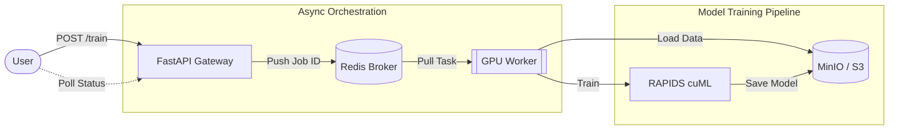

Keywords: Machine Learning, MLOps, System Design, CUDA

<video controls>
 <source src="/assets/works/distributed-machine-learning-system/dmls.webm" type="video/webm" />
</video>

## Why this project?

At my previous job, I saw a lot of Data Scientists struggle to iterate their machine learning models
due to the amount of models that they have to worked on. They often had to wait one or two days
to train their models, later to find their models might not perform well at all or even worse, failed during training.

Most of the data scientists share a pre-defined template that contains instructions to 
load data, preprocess, train and evaluate models. The downside of it, not many of them
do not come from a computer science background, so they would often write iterative codes
that slows down the entire training process and consumes a lot of compute resources.
Some others would not even dare to modify the template at all, resulting in slow training
and suboptimal models.

To make matters worse, the inefficient scripts would hoard GPU resources while training models,
making other data scientists wait longer to get their turn. At some points, these GPUs would just
sit idle.

## What I Did?

I made a centralized Machine Learning system, let's call it Distributed Machine Learning System (DMLS),
that allows data scientists to submit their training jobs via REST API. This system comes with
a dashboard to submit new jobs and monitor the status of existing jobs.

Users can upload their cleaned datasets and a file containing a set of
model hyperparameters to train their models. Then, the system will schedule the training jobs
to available GPU workers asynchronously. Once the training is on-going, users can
monitor the training metrics through the dashboard. To see the detailed model training
parameters and metrics, users can also check the MLflow tracking server integrated into the system.


Once the training is done, users can deploy their trained models to a model serving endpoint
with just one click. The deployed models can be accessed via REST API for inference.

In simple terms, this system allows users to submit, monitor, and deploy
machine learning models without blocking one another.

## System Design



## Usage

On the dashboard, users can upload two kinds of files: a CSV file containing the cleaned dataset,
and a TOML file containing the model and its set of hyperparamters.

```csv title="iris.csv"
sepal_length,sepal_width,petal_length,petal_width,species
5.1,3.5,1.4,0.2,0
4.9,3.0,1.4,0.2,0
4.7,3.2,1.3,0.2,0
4.6,3.1,1.5,0.2,0
5.0,3.6,1.4,0.2,0
...
```

Why a set of hyperparameters? Because this system uses hyperparameter optimization to find the best
set of hyperparameters for the given model. This way, users do not have to manually try
different combinations of hyperparameters, saving them a lot of time.

```toml title="hyperparameters.toml"
model = "random-forest-classifier"

n_trials = 5

[columns]
features = [
    "sepal_length",
    "sepal_width",
    "petal_length",
    "petal_width"
]
target = "species"

[n_estimators]
min = 50
max = 500

[criterion]
values = ["gini", "entropy", "log_loss"]
...
```


Once training completes, the system would store the best
hyperparameters and the trained model into MinIO (an S3-compatible object storage).


Users then can click the "Deploy job" button to deploy the trained model to a model serving endpoint.

## Conclusion


