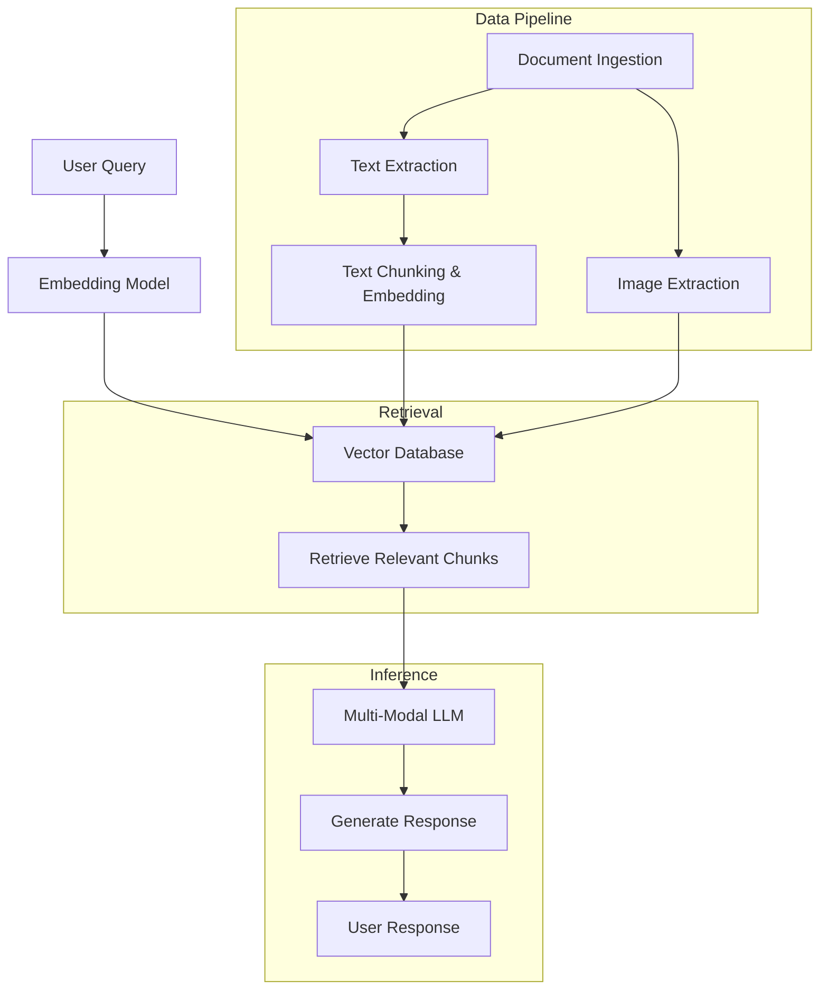
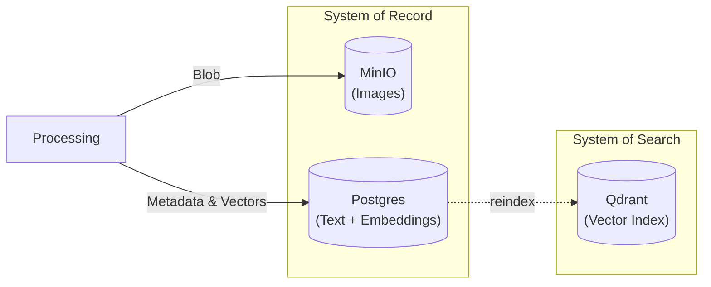

Keywords: System Design, MLOps, Fullstack Engineering, RAG

## Introduction

Back two years ago, I made my first Retrieval Augmented Generation (RAG) system when models
were not that powerful as today, and the system only took texts as inputs. 
Recently, I notice that Open-Sourced LLMs have significantly improved and I want to revisit 
RAG but this time I want to make it multi-modal, meaning that the system can take both texts and images as input.

## Why this project?

### Oversimplified System

My first RAG system did not perform as I was expected due to simple data pipeline and retrieval processes.
I was using Langchain's PDF loader that extracts texts from PDFs and turn them into markdown texts.
However, many important information were lost during the extraction process such as images and tables.
As results, the retrieval process was not effective since the knowledge base did not contain all the important information.

### Control

The initial RAG system's data pipeline was fully dependent on Langchain's built-in components.
I can not keep track which which chunks were created from which parts of the documents.

Yes, I did embed the metadata such as source document name and page number into each chunk, but
since the system only relied on OpenSearch, it was hard to trace back to the original documents when needed.

As for the retrieval process, I did not keep track of which chunks were relevant to the query.
I did not even notice that sometimes irrelevant chunks were retrieved until I manually checked the logs.

### Privacy Concern

My first RAG system did not consider the privacy of my own data at all, so basically I was feeding OpenAI
all the extracted texts directly.

### Price

Model serving APIs are not cheap, especially when you have a lot of texts/tokens to process.

## System Design

## Engineering Challanges

### Messy Parsing

Normally, documents are not well-structured, especially PDFs.
Using Langchain PDF loader would result in messy texts with broken sentences and misplaced images.

Thus, I use **Docling** to parse the documents into Markdown files for better structure.
**Docling** is capable of capturing images and converting them into base64 encoding so that
the images can be easily embedded into the prompts later.

However, **Docling** takes quite a while to parse large documents since it has to render each page
as images for OCR processing.

### The "Blocking" Problem

Imagine uploading a file with 50+ pages and waiting for the system to process all the pages.
To improve the user experience, I decoupled the ingestion proceses from the API system
so that users can upload multiple files at the same time would not affect users that 
just want to ask a quick question.

This decoupling is done by allowing the API system (the producer) to send
files into a message queue (Redis) and let Celery workers (the consumers) to process the files asynchronously.

### Persistence and Speed

Initially, I was thinking of just using a single source of truth
which is PostgreSQL with `pgvector` extension to store both texts and embeddings.

However, considering the length of base64 of images, storing images as blobs
in PostgreSQL would significantly slow down the performance of the database.

Therefore, I decided to separate the system of record and system of search.
PostgreSQL will be used as the system of record to store texts and embeddings,
MinIO will be used to store images as blobs, and Qdrant will be used as the system of search
to store the vector index for fast retrieval.

**System of record** is responsible for storing the original data and **system of search** is responsible
for storing the vector index for retrieval. With this design, I can achieve both persistence and speed.

If I notice that Qdrant is down due to any reason, I can always reindex the vectors from PostgreSQL to Qdrant
without losing any data.

### Model Serving

I had to options for model serving: Llama.cpp and Ollama.

Initially, I served the language and embedding models with Ollama, and I notice 
that it takes quite a while for Ollama to load the models into memory.

Therefore, I switch to Llama.cpp knowing that I can serve a reranking model as well with it and
the aforementioned models with just a single high-end GPU.

By serving those three different models, I have to strictly control the vRAM usage of each model.
However, the embedding and reranking model do not require that much, it's only the language model that needs a lot of vRAM.

By the time, I sent a prompt with image inputs to the language model, I do not have enough
context window due to base64 encoding of images. If I extend the context window, I will run out of vRAM
and I would not be able to serve the embedding and reranking models anymore, even worse the language model would crash.

At the end, I decided to serve the reranking model with Llama.cpp and the rest with Ollama.

### Reproducible Environment

To ensure that the development and production environments are consistent, I containerized the entire
services with Docker and orchestrated them with Docker Compose.

I also include a different model serving configurations for Nvidia GPUs and AMD GPUs.

## Conclusion

I decided to use Python since it has rich ecosystem for ML and data processing.
However, this decision introduced architectural complexity; specifically, the need
for Celery and Redis to bypass the Python GIL and handle long-running file parsing and texte embedding tasks.

In a Go or Rust environment, this could have been simplified. Their native concurrency models
(Goroutines or Async Runtimes) would allow us to implement internal worker pools and in-memory
queues within a single binary, potentially removing the need for external brokers in smaller deployments.

However, for this scale, I prefer the current decoupled approach. By separating the API (FastAPI) from the Compute (Celery),
we ensure that heavy OCR tasks never degrade the responsiveness of the HTTP server, making the system robust regardless of the language used.

## Tech Stack

1. Backend: FastAPI, Celery, Redis
2. Database: PostgreSQL with pgvector, MinIO, Qdrant
3. Model Serving: Ollama, Llama.cpp
4. Document Parsing: Docling
5. Containerization and Orchestration: Docker, Docker Compose

## Development Setup

1. OS: Pop!_OS 22.04 LTS x86_64
2. CPU: AMD Ryzen 7 3700X (16) @ 4.98 GHz
3. RAM: 78 GB DDR4
4. GPU: NVIDIA GeForce RTX 4090 24GB vRAM

## Future Works

1. Allow users to change chunked files, re-embed them without reprocessing the entire documents, and versioning the chunks for better traceability.
2. Implement a feedback loop to allow users to rate the responses and use the feedbacks to improve the system.
3. Extend the database architecture to Data Lake with Star or Galaxy Schema for future analysis and improvements.
4. Extend the data pipeline to differentiate tables from images and process them accordingly.
5. Support other document formats such as videos and audio files.
6. Converting the entire system from Python to a more performant programming language such as Go or Rust.